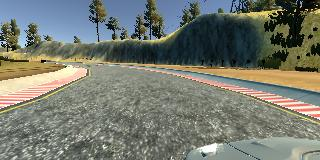
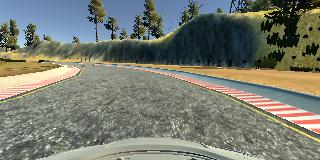
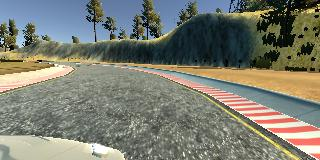
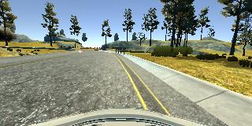
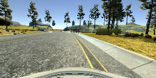
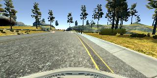
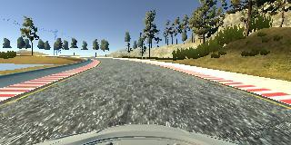
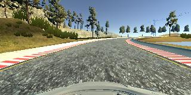

# **Behavioral Cloning** 

### Behavioral Cloning Project

The goals / steps of this project are the following:
* Use the simulator to collect data of good driving behavior
* Build, a convolution neural network in Keras that predicts steering angles from images
* Train and validate the model with a training and validation set
* Test that the model successfully drives around track one without leaving the road
* Summarize the results with a written report


[//]: # (Image References)

[image3]: ./output_images/recovery/center_2020_04_27_16_50_09_336.jpg "Recovery Image"
[image4]: ./output_images/recovery/center_2020_04_27_16_50_09_450 "Recovery Image"
[image5]: ./output_images/recovery/center_2020_04_27_16_50_09_568.jpg "Recovery Image"

## Rubric Points
#### Here I will consider the [rubric points](https://review.udacity.com/#!/rubrics/432/view) individually and describe how I addressed each point in my implementation.  

---
### Files Submitted & Code Quality

#### 1. Submission includes all required files and can be used to run the simulator in autonomous mode

My project includes the following files:
* `model.py` containing the script to create and train the model
* `data.py` containing the script to load the data, cropping the images, apply brightness to the images, augmenting the images and a batch generator.
* `drive.py` for driving the car in autonomous mode
* `model.h5` containing a trained convolution neural network 
* `writeup_srikanth_templage.md` or writeup_report.pdf summarizing the results

#### 2. Submission includes functional code
Using the Udacity provided simulator and my drive.py file, the car can be driven autonomously around the track by executing 
```sh
python drive.py model.h5
```

#### 3. Submission code is usable and readable

The `model.py` and `data.py` files contains the code for training and saving the convolution neural network. The file shows the pipeline I used for training and validating the model, and it contains comments to explain how the code works.

### Model Architecture and Training Strategy

#### 1. An appropriate model architecture has been employed

My model consists of a convolution neural network with 3x3 filter sizes and depths of 16, 32 and 64 (model.py lines 18-24) 

The model includes RELU layers to introduce nonlinearity (code line 19), and the data is normalized in the model using a Keras lambda layer (code line 17). 

#### 2. Attempts to reduce overfitting in the model

The model contains dropout layers in order to reduce overfitting (model.py lines 31, 34). 

The model was trained and validated on different data sets of data to ensure that the model was not overfitting. 
The model was tested by running it through the simulator and ensuring that the vehicle could stay on the track. 
The training loss and validation loss during the training gave a very easy way to identify the overfitting issue. 
Whenever the train loss is substantially less than the validation loss then it a very good case of overfitting.
#### 3. Model parameter tuning

The model used an adam optimizer, so the learning rate was not tuned manually (model.py line 41).

#### 4. Appropriate training data

Training data was chosen to keep the vehicle driving on the road. 
I used a combination of center lane driving, recovering from the left and right sides of the road.
I started with collecting 6 laps of data continuously, but my model did not do good while running in autonomous mode.
So, i collected the data again from scracth. This time, i started with 2 laps center line driving and ran my the model in autonomous mode,
Then found out the places where it was not doing good. After collecting the data where it was failing, then i retrained the model with the additional data. This gave the better results.

### Model Architecture and Training Strategy

#### 1. Solution Design Approach

The overall strategy for deriving a model architecture was to use the  an existing and already trained model and do modifications to make it work with the requirements.

My first step was to use a convolution neural network model similar to the Lenet model and did a few training runs. I thought this model might be appropriate because of the simiplicity to understand the workflow and see how the car is behaving with the collected dataset.

Then i used NVIDIA model but that also did not give good results. Finally i ended up using a modified version of NVIDIA model.

In order to gauge how well the model was working, I split my image and steering angle data into a training and validation set. I found that my first model had a low mean squared error on the training set but a high mean squared error on the validation set. This implied that the model was overfitting.

Then i added Drop out layers to the model and i see training ran with out any overfitting issue.

The final step was to run the simulator to see how well the car was driving around track one. There were a few spots where the vehicle fell off the track. To improve the driving behavior in these cases, I collected the data from the track specifically where it was failing.

At the end of the process, the vehicle is able to drive autonomously around the track without leaving the road.

#### 2. Final Model Architecture

The final model architecture (`model.py lines 16 - 37`) consisted of a convolution neural network with the following layers and layer sizes. The input to the mode is a shape of (None, 32, 128, 3).

|Layer (type)                 |Output Shape              |Param #   
|:-------------------------------- |:-------------------| --------:|
|lambda_1 (Lambda)            |(None, 32, 128, 3)        |0         
|conv2d_1 (Conv2D)            |(None, 30, 126, 16)       |448       
|max_pooling2d_1 (MaxPooling2 |(None, 15, 63, 16)        |0         
|conv2d_2 (Conv2D)            |(None, 13, 61, 32)        |4640      
|max_pooling2d_2 (MaxPooling2 |(None, 6, 30, 32)         |0         
|conv2d_3 (Conv2D)            |(None, 4, 28, 64)         |18496     
|max_pooling2d_3 (MaxPooling2 |(None, 2, 14, 64)         |0         
|flatten_1 (Flatten)          |(None, 1792)              |0         
|dense_1 (Dense)              |(None, 500)               |896500    
|dropout_1 (Dropout)          |(None, 500)               |0         
|dense_2 (Dense)              |(None, 100)               |50100     
|dropout_2 (Dropout)          |(None, 100)               |0         
|dense_3 (Dense)              |(None, 20)                |2020      
|dense_4 (Dense)              |(None, 1)                 |21        
|

Total params: 972,225

Trainable params: 972,225

Non-trainable params: 0

```python
model = Sequential()
model.add(Lambda (lambda X: X/255-0.5, input_shape=(32, 128, 3)))
model.add(Conv2D(16, (3, 3), activation='relu', input_shape=(32, 128, 3) ))
model.add(MaxPooling2D(pool_size=(2, 2)))
model.add(Conv2D(32, (3, 3), activation='relu'))
model.add(MaxPooling2D(pool_size=(2,2)))
model.add(Conv2D(64, (3,3), activation='relu'))
model.add(MaxPooling2D(pool_size=(2,2)))
model.add(Flatten())
model.add(Dense(500, activation='relu'))
model.add(Dropout(.5))
model.add(Dense(100, activation='relu'))
model.add(Dropout(.25))
model.add(Dense(20, activation='relu'))
model.add(Dense(1))
```

#### 3. Creation of the Training Set & Training Process

To capture good driving behavior, I first recorded two laps on track one using center lane driving. Here is an example image of center lane driving:

<table border=2>
<tr>
<td> Left Cam Image</td> 
<td> Center Cam Image</td>
<td> Right Cam Image</td> 
</tr>

<tr>
<td></td>
<td></td>
<td></td>
</tr>

</table>

I then recorded the vehicle recovering from the left side and right sides of the road back to center so that the vehicle would learn to .... These images show what a recovery looks like starting from:

<table border=2>

<tr>
<td></td>
<td></td>
<td></td>
</tr>

</table>

Due to time constrains, I did not train the model on track 2. I will work on the second track after the submission.

To augment the data sat, I also flipped images and angles. This will help in getting the data that will balance the steering angles being biased to one direction. At the same time this will increase the training data set as well.

After the collection process, I had 49862 images.

I augmented this data using the below techniques.
1. **Including Left and Right images :** I added the left and right images and adjusted the steering angle by adding +0.25 (left) & -0.25 (right) to the existing steering value. I selected random 50% data for left and another random 50% for the right images. 

```python
count = len(driving_log)

    left = np.random.choice(count, count//2, replace=False)
    right = np.random.choice(count, count//2, replace=False)
    center_data = driving_log[:, [CENTER, STEERING, THROTTLE, BRAKE, SPEED]]

    #
    # Add 0.25 to the left camera angle. # Main idea being left camera has to move right to get to the center.
    left_data = driving_log[:, [LEFT, STEERING, THROTTLE, BRAKE, SPEED]] [left, :]
    #left_data[:, 1] += 0.25

    # Subtracct 0.25 to the right camera steering angle. subtract 0.25 to move left to get to the center.
    right_data = driving_log[:, [RIGHT, STEERING, THROTTLE, BRAKE, SPEED]] [right, :]
    #right_data[:, 1] -= 0.25

    left_data[:, [STEERING]] = left_data[:, [STEERING]] + 0.25
    right_data[:, [STEERING]] = right_data[:, [STEERING]] - 0.25

    data = np.concatenate( (center_data, left_data) )
    data = np.concatenate( (data, right_data) )
    np.random.shuffle(data)
    train_data, valid_data = model_selection.train_test_split(data, test_size=.2)
```
2. **Flipping Data :** To further augment the data , I flipped images and angles thinking that this would increase the data available for training as well as help in balancing the right vs the left steering angles in the sample.

<table>
<tbody>
<tr>
<td> Actual Iamge 
<td> Flipped Image 
</tbody>
</table>

``` python
    for row in batch:
        file_name_part = pathlib.PurePath(row[IMG]).name
        full_file_path = pathlib.Path("datasets/sri/srikanth/IMG/" + file_name_part)
        if full_file_path.exists():
            if full_file_path.is_file():
                orig_image = plt.imread("datasets/sri/srikanth/IMG/" + file_name_part)
                bright_image = apply_brightness(orig_image)
                final_image = process_input_image(bright_image, file_name_part)
                if final_image is not None:
                    angle = row[STEERING]
                    x.append( final_image )
                    y.append( angle )
                    # An effective technique for helping with the left turn bias invovles flipping images and taking the oppsite sign
                    # of the steering measurement.
                    # image_flipped = np.fliplr(image)
                    # measurementr_flipped = -measurement
                    # Add a flipped image for every image.
                    x.append( final_image[:, ::-1, :] )
                    y.append( -1 * angle )
                else:
                    print("Corrupted image - {}".format(full_file_path))
```

3. **Adding brightness to the images:**
```python
def apply_brightness(image):
    """
    apply random brightness on the image
    """
    # Input image from the training data is in RGB format since i used to `plt.imread()` which returns the image in RGB format.
    # First we convert this into HSV
    # drive.py takes input in RGB format - so converting from HSV to RGB before returning.
    image = cv2.cvtColor(image, cv2.COLOR_RGB2HSV)
    random_bright = .25 + np.random.uniform()

    # scaling up or down the V channel of HSV
    image[:, :, 2] = image[:, :, 2] * random_bright
    return cv2.cvtColor(image, cv2.COLOR_HSV2RGB)
```


I finally randomly shuffled the data set and put Y% of the data into a validation set. 
```python
np.random.shuffle(data)
train_data, valid_data = model_selection.train_test_split(data, test_size=.2)
```

I used this training data for training the model. The validation set helped determine if the model was over or under fitting. The ideal number of epochs was 8 as evidenced by training and validation loss. I used an adam optimizer so that manually training the learning rate wasn't necessary.

```
Epoch 1/8
316/316 [==============================] - 102s 323ms/step - loss: 0.0345 - val_loss: 0.0299
Epoch 2/8
316/316 [==============================] - 101s 319ms/step - loss: 0.0299 - val_loss: 0.0291
Epoch 3/8
316/316 [==============================] - 101s 320ms/step - loss: 0.0291 - val_loss: 0.0286
Epoch 4/8
316/316 [==============================] - 101s 320ms/step - loss: 0.0288 - val_loss: 0.0281
Epoch 5/8
316/316 [==============================] - 101s 320ms/step - loss: 0.0286 - val_loss: 0.0279
Epoch 6/8
316/316 [==============================] - 101s 320ms/step - loss: 0.0284 - val_loss: 0.0278
Epoch 7/8
316/316 [==============================] - 101s 321ms/step - loss: 0.0283 - val_loss: 0.0272
Epoch 8/8
316/316 [==============================] - 101s 321ms/step - loss: 0.0282 - val_loss: 0.0276
Model saved.
```

#### 4. Output Video

The outout video is generated by running the video.py on the camera images generated during the autonomous driving.

```
$ python drive.py model.h5 runs/run4
$ python video.py runs/run4
```

[](https://youtu.be/DFOJoOE99ro)

[https://youtu.be/zI6V8Kzvbl0](https://youtu.be/DFOJoOE99ro)

### Additional Notes

#### ``` Observed the model that was trained using a GPU based EC2 instance is not working on the simulator that is running in Udacity's provided working environment's simulator. Later i saw the notes that due to different underlying hardware, one model that is working in one machine might not work in another machine. ```

#### ``` When i run the training on the same set of data, mulitple times, the resulted models might not work same when you run it in autonomous mode. It could be because of left and right image selections were random in each training.```